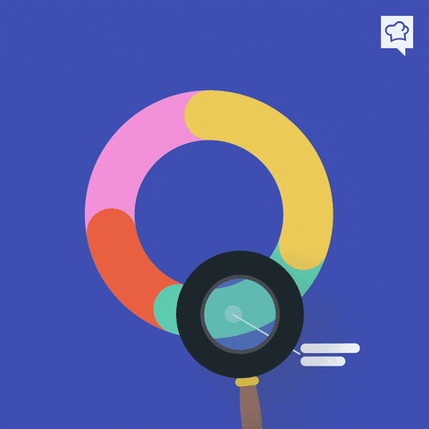

<!-- RAINBOW LINE TOP -->

<!-- GIF HEADER -->

<h2 style="max-width:700px" > About Me </h2>

Currently, I'm exploring tech at Blue Nose while studying AI Engineering 🤖 at UDESA. Learning C 🌱 on the side. Chat with me about SQL, Java, JavaScript, or MongoDB 💬. And when I'm not coding, you'll catch me strategizing on the Chessboard ⚡.

<h2 style="max-width:700px ;font-size:30px"> Skills  </h2>
<table style="width: 100%; border-collapse ; max-width:700px;  collapse; ">
  <tr   style="width: 100%;">
    <th style="text-align: center; border: 1px solid grey; width:33%;">
        FrontEnd
    </th>
    <th style="text-align: center; border: 1px solid grey;  width: 33%;">
        FullStack
    </th>
    <th style="text-align: center; border: 1px solid grey;  width: 33%;">
        Backend
    </th>
  </tr>
  <tr>
    <td style="text-align: center; border: 1px solid grey;">
        
        
        
    </td>
    <td style="text-align: center; border: 1px solid grey;">
        
        
        
    </td>
    <td style="text-align: center; border: 1px solid grey;">
        
        
    </td>
     </tr>
<tr>
    <td style="text-align: center; border: 1px solid grey;">
        
        
        
    </td>
    <td style="text-align: center; border: 1px solid grey;">
        
        
           
    </td>
</tr>
<tr>
    <td style="text-align: center; border: 1px solid grey;">
        
        
    </td>
</tr>
</table>
<table style="width: 100%; border-collapse: collapse;max-width:700px; ">
<tr>
    <th style="text-align: center; border: 1px solid grey;  width: 33.3%;">
        Databases
    </th>
    <th style="text-align: center; border: 1px solid grey;  width: 33.3%;">
        Other Languages
    </th>
        <th style="text-align: center; border: 1px solid grey;  width: 33.3%;">
        Operating Systems
    </th>
  </tr>
     <td style="text-align: center; border: 1px solid grey;">
        
        
        
        </td>
    <td style="text-align: center; border: 1px solid grey;">
        
        
        
    </td>
    <td style="text-align: center; border: 1px solid grey;">
        
        
        
    </td>
</tr>
<tr>
 <td style="text-align: center; border: 1px solid grey;">
        
    </td>
    <td style="text-align: center; border: 1px solid grey;">
        
    </td>
    <td style="text-align: center; border: 1px solid grey;">
        
    </td>
</tr>
</table>
<table style="width: 100%; border-collapse: collapse; max-width:700px; ">
<tr>
    <th style="text-align: center; border: 1px solid grey;  width: 100%;">
        Tools
    </th>
    </tr>
    <tr>
      <td style="text-align: center; border: 1px solid grey;">
        
        
        
        
        
        
        
        
         
        
        
    </td>
    </tr>
    </table>

<h2 style="display:flex; align-items:center ; justify-content:center ; gap:5px ; max-width:700px;
font-size:30px">  Github Stats</h2>

<h2 style="max-width:700px ;font-size:25px">  Connect with me </h2>

 
   

<!-- GIF FOOTER -->

